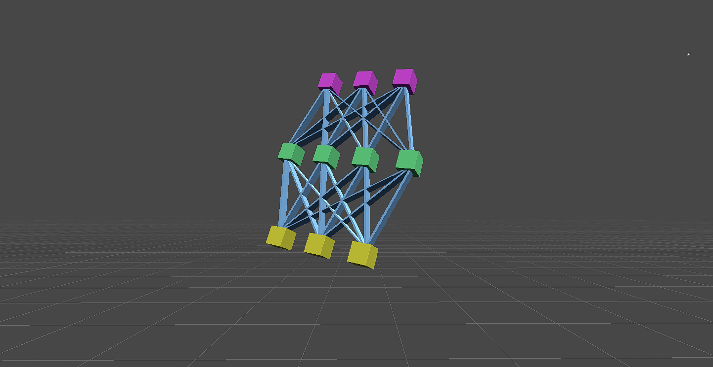

# MLAgent
Set of C# Scripts that can be used to train your AIs in Unity Engine.
Use Latest version Framework folder ONLY.

The Neural Network Class contains the code for instantiating a Artificial Neural Network based on Evolutionary Training with random mutations.

The use of this framework is done by implementing a training strategy, strictly said by overriding some methods where you send observations (inputs) and receive actions (outputs) and creating a suitable, stable and well designed training environment.

Check the documentation "How to use the Framework". 
-Performance leaks where solved starting from version 2.0. 
-Multienvironmental Training set for upcoming version 3.0. 
